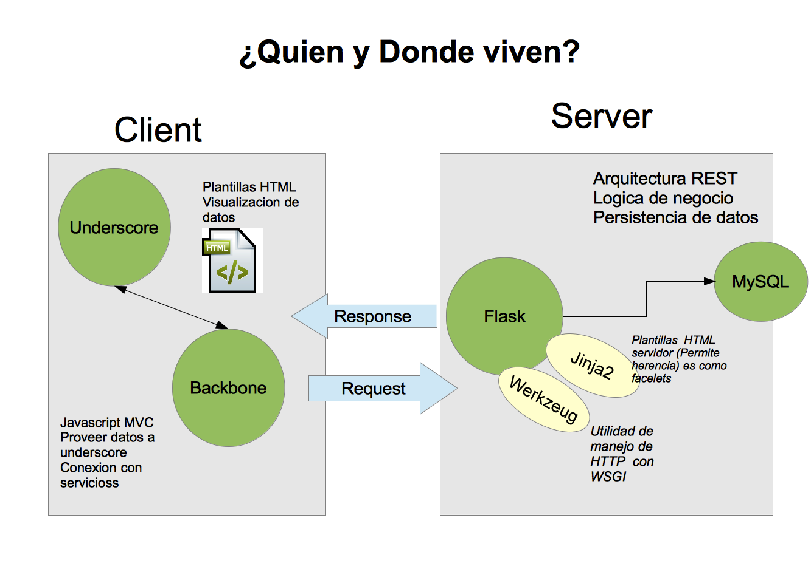

#Desarrollo Kitch Application

**Kitch** es una aplicacion Web con el proposito de mejorar los servicios ordenes en establecimientos orientado a este enfoque, aplicable tanto a bares como restaurantes.

- - -
- Revisa los [Requerimientos](docs/requirements.md) antes de comenzar. 
- Algunas preguntas frecuentes en la seccion ([FAQ](docs/faq.md))  

##Gráfica de arquitectura

###Estructura del proyecto
Es muy probable que si leas esto estes en el repositorio. El proyecto esta estructurado de la siguiente forma.
	
	kitchkitch
		MakeFile
		docs
		kitch
		|____default_settings.py
		|____menus
		| |______init__.py
		| |____templates
		|____requirements.txt
		|____runserver.py
		|____schema.sql
		|____static
		|____test
		|____users
		|____utils

*Si crees que algo deberia ser organizado de forma diferente siente libre de hacer dichas mejoras y detallarlas en tus commit.*

###Dependencias

En [requirements.txt](kitch/requirements.txt) puedes encontrar las dependencias de la plataforma

- [flask](flask.pocoo.org)
- [Flask-Login](http://packages.python.org/Flask-Login/)
- [Flask-SQLAlchemy](http://pythonhosted.org/Flask-SQLAlchemy/)
- [Jinja2](http://jinja.pocoo.org/docs/)
- [Werkzeug](http://werkzeug.pocoo.org/)

Con pip puedes instalar todas las dependencias ejecutando:

	pip install -r requirements.txt

Si necesitas saber [¿como instalar pip?](docs/faq.md)

###Base de datos

- Crea dos bases de datos en MySQL: **kitch** y **kitch_test**
- Usa el script **schema.sql** para crear el esquema de datos. Si te sientes comodo con consola puedes usar:

		mysql -u root -p kitch < schema.sql
		mysql -u root -p kitch_test < schema.sql

El script tambien creara un usuario adicional que es kitch por ello debe ser ejecutado por priemra vez 
por root para podes conceder los permisos necesarios.

Actualmente Kitch cuenta con dos esquemas de bases de datos.

- **Desarrollo (kitch)** Cuando corres la aplicacion normal con make run o con python **runserver.py**

- **Suite de pruebas (kitch_test)** Cuando ejecutas la suite de pruebas habilita Testing en la configuracion de la app. `config['TESTING'] =True`

###Ejecutando la aplicacion

Existen dos formas de comprobar que todo esta trabajando correctamente, la primera es correr la aplicacion con:

	python runserver.py
	
La seguna para hacer una prueba mas a profundidad es utilizar el script de pruebas:

	python test/suite_run.py

En caso que alguna prueba falle, reportala a <joseayerdis@gmail.com> con los respectivos detalles. 

###Usando Make

Dentro del proyecto hay un MakeFile para facilitar las tareas de pruebas con las siguientes opciones:

- **clean**: remover todos los archivos pyc.
- **install-db**: instala la bases de datos kitch y kitch_test.
- **run**: correr la aplicacion.
- **test**: ejecutar la suite de pruebas. Ademas con el parametro SUITE puedes seleccionar individualmente las pruebas que quieras ejecutar. Ej.

		make test SUITE=login,menu

